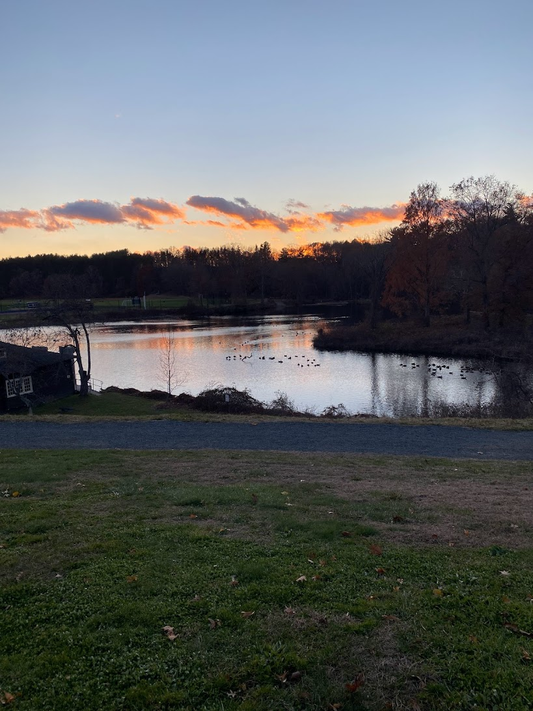

```{r setup, include=FALSE}
knitr::opts_chunk$set(echo = TRUE)
```
```{r, echo=FALSE}
library(sf)
library(maps)
library(ggplot2)
library(tidyverse)

ry_cities <- tibble(
  name=c("New York City", "Houston", "Northampton"),
  lat = c(40.7128, 29.7604, 42.3251),
  lon = c(-74.006, -95.3698, -72.6412)
)

ry_cities_sf <- ry_cities %>% 
    st_as_sf(coords = c("lon", "lat"), crs = 4326)

USA_map <-  maps::map("state", plot = FALSE, fill = TRUE)
USA_sf <- USA_map %>% 
  st_as_sf(crs = 4326)
```

## New York, NY 
For the first five years of my life and during all of middle and high school, I lived in New York City! I moved around between Manhattan and the Bronx.


## Houston, TX
For 1st-5th grades, I lived in Houston, Texas!


## Northampton, MA
For college, I am now in Northampton, Massachusetts!




## Map of Where I've Lived
```{r, echo=FALSE}
ggplot()+
  geom_sf(data=USA_sf)+
  geom_sf(data=ry_cities_sf)
```

